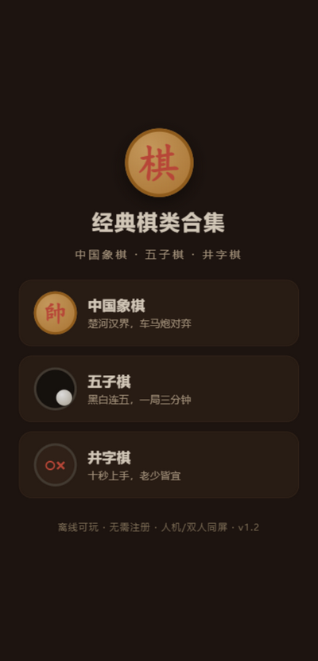
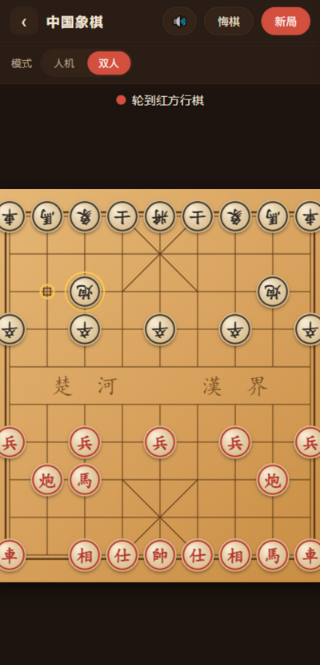
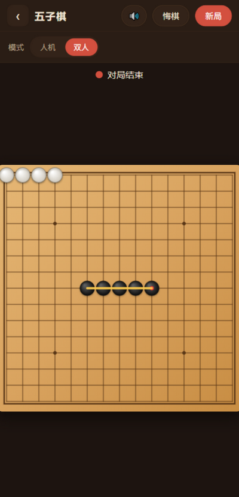

# 经典棋类合集（jingdian-qilei）

中国象棋 · 五子棋 · 井字棋，一部手机装三盘好棋。**零权限、完全离线**，人机对弈 / 双人同屏，约 58 KB。

| 首页 | 中国象棋（双人：黑方字面反向） | 五子棋（胜利连线） |
| --- | --- | --- |
|  |  |  |

## 特性

- **三款经典棋**
  - 中国象棋：完整规则（蹩马腿 / 塞象眼 / 炮架 / 白脸将 / 过河兵横走），AI 为 α-β 剪枝迭代加深搜索（含静态吃子延伸，带时间上限保护）
  - 五子棋：15 路自由规则，棋型评分 AI（活四冲四活三），困难档带双层前瞻
  - 井字棋：完备博弈搜索，困难档理论上不可战胜
- **人机三档难度**：简单（带随机）/ 普通（开局多样化，不重样）/ 困难（严格最强）
- **双人同屏**：轮流落子；象棋黑方棋子字面反向，面对面各看各的
- **手感细节**：落子缩放动画、可落点提示、将军红光、胜利连线、结算浮层、终局可悔棋复盘、AI 最短思考停顿
- **设置自动记忆**：难度、模式、音效开关存 localStorage
- **零权限 APK**：Manifest 不申请任何 Android 权限，无网络、无跟踪、无第三方依赖；音效为 WebAudio 本地合成

## 安装

从 [Releases](https://github.com/cjy-kenny/jingdian-qilei/releases) 下载 APK 直接安装（系统提示时允许"安装未知应用"）。

> 微信传输 APK 会被当网页打开：改传 zip，手机上解压后长按 APK → "用其他应用打开" → 打包安装程序。

## 本地构建（无需 Gradle / AGP）

工具链来自腾讯镜像（dl.google.com 不可达时同样适用）：

1. 下载并解包 [build-tools_r34-windows.zip](https://mirrors.cloud.tencent.com/AndroidSDK/build-tools_r34-windows.zip) 与 [platform-34-ext7_r03.zip](https://mirrors.cloud.tencent.com/AndroidSDK/platform-34-ext7_r03.zip) 到 `_build/`（结构：`_build/android-14/`、`_build/android-34/android.jar`）；R8 建议另下 [r8-9.4.28.jar](https://maven.aliyun.com/repository/google)（build-tools 34 自带 d8 在新版 JDK 上有 NPE）
2. 图标（可选，仓库已含）：`powershell -NoProfile -ExecutionPolicy Bypass -File tools/make_icons.ps1`
3. 一键构建：`python android/build_apk.py` —— aapt2 编译链接 → javac → d8 → 组装 zip → zipalign → apksigner 签名，产物在 `dist/`
4. 微信安装包：`python tools/make_install_zip.py <版本号>`

## 目录结构

```
app/                  游戏本体（HTML/CSS/JS，即 APK assets 源）
  js/common.js        屏幕框架 / 音效 / 难度与模式记忆 / 结算
  js/xiangqi.js       象棋：规则引擎 + α-β 搜索 + Canvas 渲染
  js/gomoku.js        五子棋：棋型评分 + 双层前瞻
  js/tictactoe.js     井字棋：完备博弈搜索
android/              WebView 壳（单 Activity，零权限）+ build_apk.py 构建流水线
tools/                图标生成（PowerShell System.Drawing）/ 安装包打包
screenshots/          应用截图
```

## 技术说明

壳只是一个开启 JavaScript 的 WebView（`file:///android_asset`，返回键挂起保留棋局）；全部对弈逻辑为纯前端 JS，Canvas 绘制，`localStorage` 持久化。构建流水线纯 Python + Android SDK 工具链命令行，不依赖 Gradle/AGP，适合国内网络环境复用。

## License

[MIT](LICENSE)
